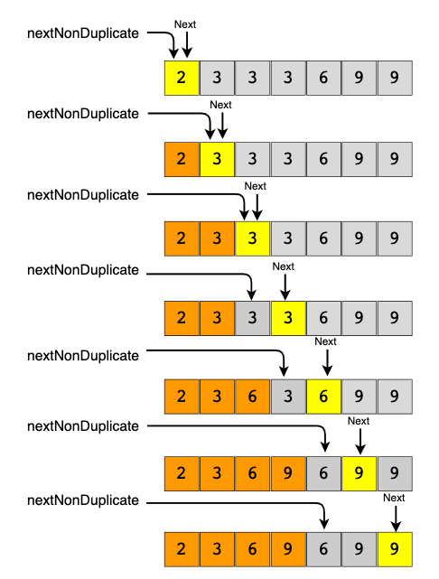

# {{ $frontmatter.title }}

> {{ $frontmatter.description }}



My solution:

<<< @/algos/grokking/two-pointers/remove-duplicates.js#sol

Theirs:

```js
function removeElements(arr, key) {
  let nextNonDuplicate = 1

  let i = 1
  while (i < arr.length) {
    if (arr[nextNonDuplicate - 1] !== arr[i]) {
      arr[nextNonDuplicate] = arr[i]
      nextNonDuplicate += 1
    }
    i += 1
  }

  return nextNonDuplicate
}
```

Problem 1: Given an unsorted array of numbers and a target ‘key’, remove all instances of ‘key’ in-place and return the new length of the array.

```js
function removeElement(arr, key) {
  let i = 0
}
```
